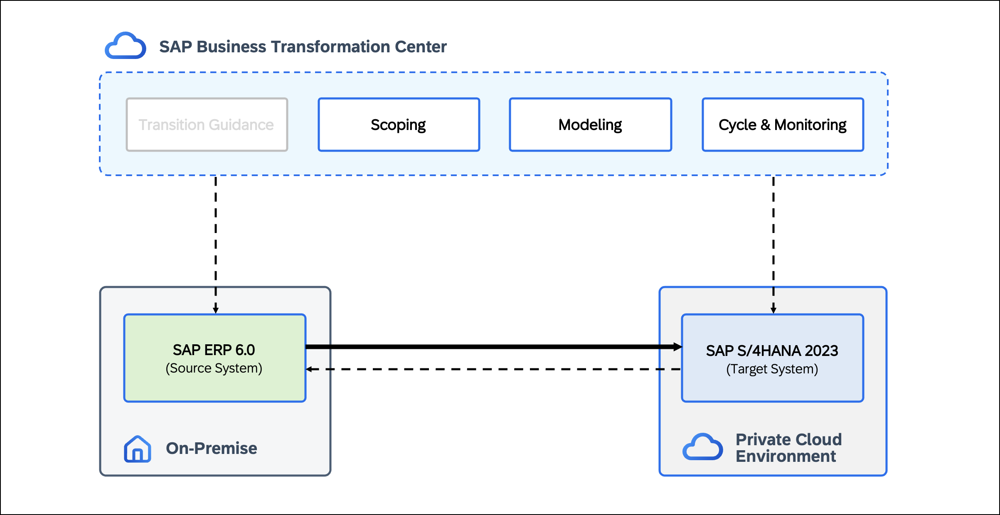

# CS162 - Data-driven transition guidance toward the cloud

## Overview

This hands-on session shows how to execute a <b>Selective Data Transition</b> using <b>SAP Business Transformation Center</b> (BTC). You will perform a guided migration from <b>SAP ERP 6.0</b> to <b>SAP Cloud ERP Private</b>, focusing on transferring only the data that remains relevant for future business operations.

Using <b>SAP Business Transformation Center</b>, you will analyze the <b>source system</b>, <b>define your transition scope</b>, and <b>execute the migration</b> in a controlled and data-driven way.

  

## Requirements
To complete the exercises in this hands-on session, you need **SAP GUI** and a **web browser** (preferably **Google Chrome**).  

## Exercises

Building on the prepared landscape, the exercises guide you through <b>each phase</b> of the transition — from <b>scoping</b> and <b>modeling</b> to <b>executing</b> and <b>monitoring</b> the results in the target system.

Step by step, you will refine your <b>transition scope</b>, create a <b>digital blueprint</b>, and perform a <b>complete migration run</b>, validating business data directly in the target system.

Below you find an overview of all exercises included in this hands-on session:

- [Scenario Overview](exercises/ex0/)
- [Exercise 1 - Build the Foundation: Upload UDP File](exercises/ex1/)
- [Exercise 2 - Initialize Project: Create Digital Blueprint](exercises/ex2/)
- [Exercise 3 - Scope the Blueprint: Select & Reduce Data](exercises/ex3/)
- [Exercise 4 - Build the Model: Create Transformation Model & Version](exercises/ex4/)
- [Exercise 5 - Initialize Cycle: Create Cycle & Run Prevalidation](exercises/ex5/)
- [Exercise 6 - Execute Data Validation: Configure DTV Project & Monitor Cycle](exercises/ex6/)
- [Exercise 7 - Validate Results: Complete Data Validation](exercises/ex7/)

 

## Contributing
Please read the [CONTRIBUTING.md](./CONTRIBUTING.md) to understand the contribution guidelines.  

## Code of Conduct
Please read the [SAP Open Source Code of Conduct](https://github.com/SAP-samples/.github/blob/main/CODE_OF_CONDUCT.md).  

## How to obtain support

Support for the content in this repository is available during the actual time of the online session for which this content has been designed. Otherwise, you may request support via the [Issues](../../issues) tab.  

## License
Copyright (c) 2025 SAP SE or an SAP affiliate company. All rights reserved. This project is licensed under the Apache Software License, version 2.0 except as noted otherwise in the [LICENSE](LICENSES/Apache-2.0.txt) file.
